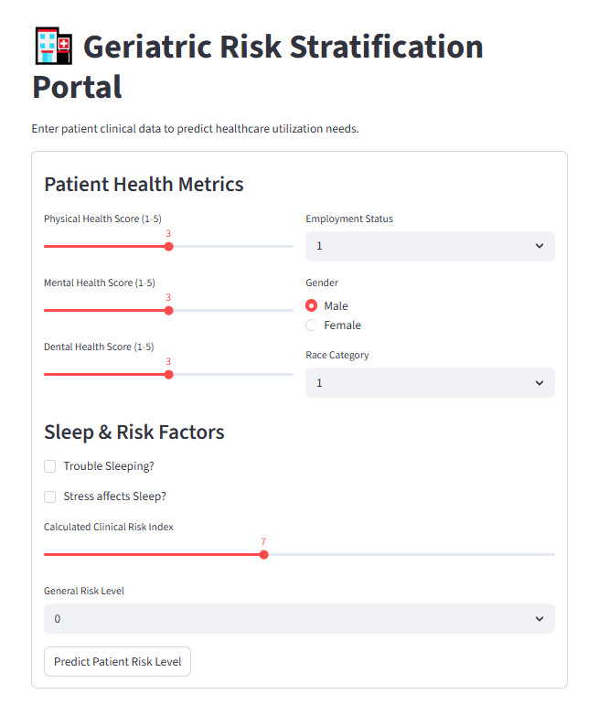

# Geriatric Patient Risk Stratification: An AI-Driven Approach

## Overview
This repository contains a specialized machine learning framework designed to predict and stratify healthcare utilization risks among geriatric populations. Developed with a focus on clinical integration, the project leverages **Deep Learning (MLP)** and **Ensemble Methods** to provide actionable insights for hospitals like **Humanitas**, aiming to optimize patient care and resource allocation.

##  Key Features
- **Hybrid Modeling:** Comparison between **Random Forest (Balanced)** and a custom **PyTorch Multi-Layer Perceptron (MLP)**.
- **Automated Pipeline:** An end-to-end workflow (Scikit-learn Pipeline) for seamless data preprocessing and real-time inference.
- **Clinical Dashboard:** A live **Streamlit** application providing a user-friendly interface for healthcare providers.
- **Advanced Preprocessing:** Implementation of **SMOTE** for handling imbalanced medical datasets and custom **Feature Engineering** (Clinical Risk Index).

##  Methodology 
1. **Exploratory Data Analysis (EDA):** Identifying non-linear correlations between physical health, sleep patterns, and medical visits.
2. **Model Training:** - **MLP:** Trained for 100 epochs using **Adam Optimizer** and **Cross-Entropy Loss**.
   - **RF:** Optimized with class weighting to handle minority risk groups.
3. **Evaluation:** Detailed analysis via **Confusion Matrices** and **Classification Reports** to ensure clinical safety and reliability.

##  Technical Stack
- **Backend:** Python, PyTorch, Scikit-learn, Pandas, NumPy.
- **Visualization:** Matplotlib, Seaborn.
- **Deployment:** Streamlit, Ngrok (for secure tunneling).

##  Dashboard Preview

##  How to Run
1. Clone the repository: `git clone https://github.com/yourusername/project-name.git`
2. Install dependencies: `pip install -r requirements.txt`
3. Run the dashboard: `streamlit run app.py`

##  Future Work
- Integration of **Explainable AI (XAI)** using SHAP to interpret clinical decision paths.
- Expansion to **Longitudinal Data** for trend-based risk forecasting.

---
**Author:** Nastaran 
**Affiliation:** AI & Data Science in Healthcare
